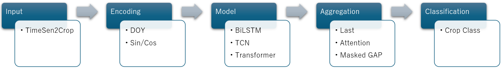
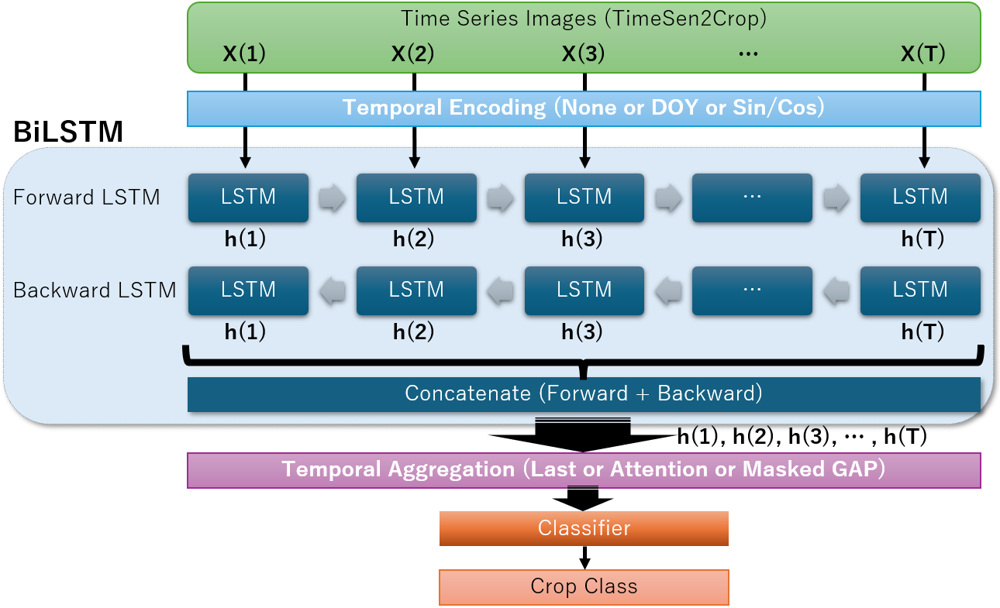
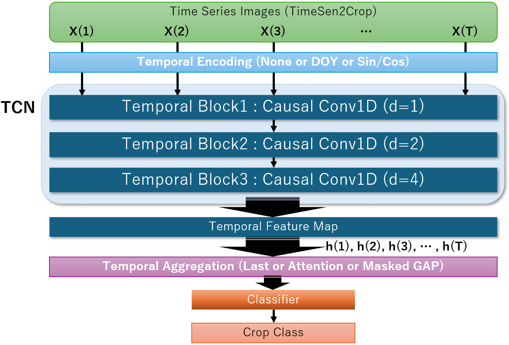
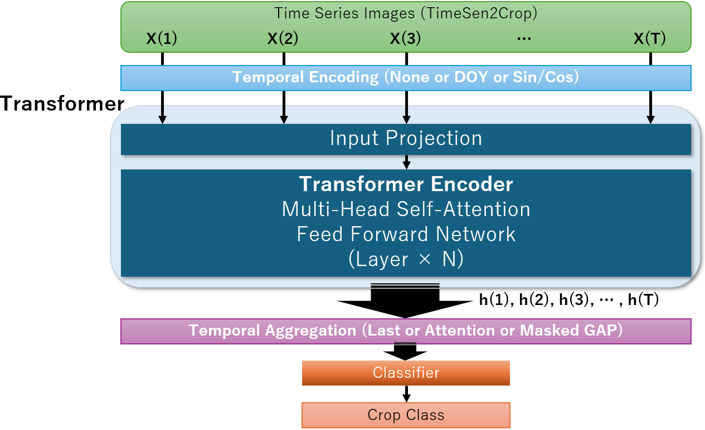
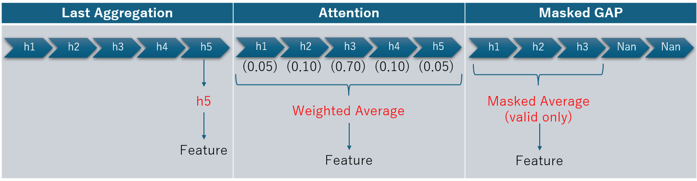
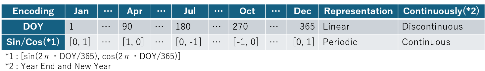

# 🌾 CropClassification-1D Benchmark Study

## Sentinel-2時系列データを用いた作物分類のための画素ベース深層学習モデル比較

本リポジトリでは、Weikmann et al. によって公開された **TimeSen2Crop** データセットを用いて、Sentinel-2衛星の時系列データに基づく作物分類モデルの比較ベンチマークを構築する。TimeSen2Cropは、Sentinel-2時系列データを用いた作物分類研究のために構築された公開ベンチマークデータセットである。

本研究は、新規モデルの提案を目的とするものではなく、以下の要素が作物分類性能に与える影響を、同一条件下で体系的に比較・評価することを目的とする。

* 深層学習モデルの構造
* 時間情報の表現方法（Temporal Encoding）
* 時系列特徴量の集約方法（Temporal Aggregation）

比較対象としたモデルは以下の3種類である。

* **BiLSTM**（RNNベース）
* **TCN（Temporal Convolutional Network）**
* **Transformer Encoder**（Self-Attentionベース）

---

# 🎯 研究目的

本研究では、以下の3つの観点から比較実験を実施した。

## 1. Sentinel-2時系列データに適した系列モデルは何か？

以下の代表的な系列モデルを比較した。

* BiLSTM
* TCN
* Transformer Encoder

---

## 2. 観測日時をどのように表現するべきか？

以下の3種類のTemporal Encodingを比較した。

| Encoding    | 内容                  |
| ----------- | ------------------- |
| **None**    | 時間情報を与えない           |
| **DOY**     | Day of Year（観測日の通日） |
| **Sin/Cos** | Sin・Cosによる周期表現      |

---

## 3. 可変長時系列をどのように集約するべきか？

以下の3種類のTemporal Aggregationを比較した。

| Aggregation | 内容                            |
| ----------- | ----------------------------- |
| Last        | 最終時刻の特徴量を利用                   |
| Attention   | Attention Pooling             |
| Masked GAP  | Masked Global Average Pooling |

---

# 📌 全体の処理フロー

本研究では、Sentinel-2時系列データに対してTemporal Encoding、時系列モデル、Temporal Aggregationを順番に適用し、作物分類を実施した。

<p align="center">

</p>

---

# 🛰 データセット

本研究では、公開されている **TimeSen2Crop** データセットを使用している。
各サンプルは以下の情報から構成されている。詳細については引用文献を参照されたい。

* Sentinel-2の時系列スペクトル特徴量
* 作物クラスラベル
* 可変長の観測系列

入力データの形状は

```text
(T, C)
```

で表される。

ここで、

* **T**：観測時点数
* **C**：入力特徴量数

を表す。

Sentinel-2では、雲の影響や撮影スケジュールによって観測日数が一定ではないため、サンプルごとに系列長が異なる。

例えば、

```text
Sample A : (31, C)

Sample B : (36, C)

Sample C : (38, C)
```

のように、各圃場で利用できる観測回数が異なる。

そのため、本リポジトリでは**可変長系列をそのまま扱える実装**を採用している。

---

# 📂 リポジトリ構成

```text
.
├── core/
│   ├── fileIF.py
│   ├── inference.py
│   ├── train.py
│   └── utils.py
│
├── dataset/
│   ├── cache_builder.py
│   └── cache_dataset.py
│
├── models/
│   ├── common.py
│   ├── lstm.py
│   ├── tcn.py
│   └── transformer.py
│
├── pipeline/
│   ├── cache_pipe.py
│   ├── inference_pipe.py
│   └── train_pipe.py
│
├── figures/
│   ├── model_bilstm.png
│   ├── model_tcn.png
│   ├── model_transformer.png
│   ├── pipeline.png
│   ├── temporal_aggregation.png
│   └── temporal_encoding.png
│
├── main.py
├── main.yaml
├── LICENSE
├── requirements.txt
├── README_en.md
└── README_jp.md
```

`figures/` フォルダには、READMEで使用する概念図や実験結果の図を配置している。

---

# ⚙ 動作環境

## 必要環境

* Python 3.10以上
* PyTorch
* NumPy
* Pandas
* scikit-learn
* matplotlib
* rasterio
* PyYAML
* tqdm

必要なライブラリは以下の手順に従ってインストールする。

```bash
pip install -r requirements.txt
```

GPU環境で実行する場合は、PyTorch公式のインストールガイドに従い、使用するCUDAバージョンに対応したPyTorchをインストールする。

### 動作確認環境

- Python 3.10
- PyTorch 2.5
- CUDA 12.1

---

# 🚀 実行方法

本プログラムは、`main.yaml` の `proc_type` を変更することで、各処理を実行する。

| proc_type | 処理 |
|-----------|------|
| 0 | キャッシュデータ作成 |
| 1 | 学習 |
| 2 | 推論 |

実行コマンドは以下に示すコマンドで共通である。

```bash
python main.py
```

または、

```bash
python main.py --yaml_file main.yaml
```

`--yaml_file` を省略した場合は、`main.yaml` が使用される。

### 1. キャッシュデータ作成

`main.yaml`

```yaml
proc_type: 0
```

```bash
python main.py
```

### 2. 学習

`main.yaml`

```yaml
proc_type: 1
```

```bash
python main.py
```

### 3. 推論

`main.yaml`

```yaml
proc_type: 2
```

```bash
python main.py
```

---

# 🧠 Model Architecture

本研究では、異なる時間モデリング能力を持つ3種類の深層学習モデルを比較した。

---

## BiLSTM

<p align="center">

</p>

過去・未来方向の情報を利用する双方向LSTMにより、
時系列特徴を抽出する。

---

## TCN

<p align="center">

</p>

Temporal Convolutionによって局所的な時間パターンを抽出する。

---

## Transformer Encoder

<p align="center">

</p>

Self-Attentionにより観測間の長距離依存関係を学習する。

---

# 📖 実験概要

本研究では、Sentinel-2時系列データにおけるTemporal Modelingの影響を分析するため、3段階の比較実験を実施した。
実験では、以下に示す3つのPhaseに分けて評価している。

1. **Phase 1**：Temporal Aggregationの比較
2. **Phase 2**：最適Aggregationを固定したTemporal Encodingの比較
3. **Phase 3**：各モデルの最良条件による最終比較

各Phaseの実験設定および結果を以下に示す。

---

# Phase 1 — Temporal Aggregation比較

## 目的

Temporal Encodingを **DOY（Day of Year）に固定**し、時系列特徴量の集約方法が分類性能へ与える影響を評価した。Sentinel-2観測は可変長系列であるため、観測系列をどのように分類特徴へ変換するかが重要となる。

<p align="center">

</p>

---

## 比較条件

| Aggregation | 内容                    |
| ----------- | --------------------- |
| Last        | 最終観測時点の特徴量を利用         |
| Attention   | Attentionによる重要時点の重み付け |
| Masked GAP  | 有効観測のみを利用した平均Pooling  |

各モデルについて、同一条件でAggregationのみを変更して比較した。

---

## 結果

Validation Accuracy:

| Model       |       Last |  Attention | Masked GAP | 採用条件       |
| ----------- | ---------: | ---------: | ---------: | ---------- |
| BiLSTM      |     0.7445 | **0.8040** |     0.7681 | Attention  |
| TCN         |     0.5525 |     0.7753 | **0.8091** | Masked GAP |
| Transformer | **0.8410** |     0.8332 |     0.8228 | Last       |

---

## 考察

モデルによって最適なAggregation方法は異なる結果が得られた。

### BiLSTM

Attention Poolingが最も高い性能を示した。

LSTMは時系列情報を逐次的に処理するため、作物フェノロジー上重要な時期の観測を自動的に選択できるAttention機構が有効だったと考えられる。

---

### TCN

Masked GAPが最も高い性能を示した。

TCNでは畳み込みによって局所的な時間パターンを抽出するため、全観測期間の特徴を平均的に利用するMasked GAPが有効だった。

---

### Transformer

Last Aggregationが最高性能となった。

Self-Attentionによって系列全体の関係性を学習できるため、最終表現のみでも十分な情報を保持できたと考えられる。

---

# Phase 2 — Temporal Encoding比較

## 目的

Phase 1で得られた各モデルの最適Aggregationを固定し、時間情報の表現方法による影響を評価した。Sentinel-2観測では、観測日時そのものが作物フェノロジーを表す重要な情報となる。本研究では以下の3種類を比較した。

<p align="center">

</p>

---

## 固定条件

| Model       | Aggregation |
| ----------- | ----------- |
| BiLSTM      | Attention   |
| TCN         | Masked GAP  |
| Transformer | Last        |

---

## 比較条件

| Encoding | 内容          |
| -------- | ----------- |
| None     | 時間情報なし      |
| DOY      | Day of Year |
| Sin/Cos  | 周期的時間表現     |

---

## 結果

Validation Accuracy:

| Model       |       None |        DOY | Sin/Cos | 採用条件 |
| ----------- | ---------: | ---------: | ------: | ---- |
| BiLSTM      |     0.7360 | **0.8040** |  0.7725 | DOY  |
| TCN         |     0.7996 | **0.8091** |  0.8008 | DOY  |
| Transformer | **0.8640** |     0.8410 |  0.7779 | None |

---

## 考察

Temporal Encodingの効果はモデルによって異なる結果が得られた。

### BiLSTM

DOYを入力することで性能が大きく向上した。

作物の成長過程は季節変化と密接に関係するため、絶対的な観測時期情報が有効だったと考えられる。

---

### TCN

DOYによる改善は小さいものの、安定した向上が確認された。

TCNは時系列パターンを畳み込みによって抽出できるため、追加の時間情報による改善は限定的だった。

---

### Transformer

時間情報を追加しない条件が最高性能となった。

TransformerはSelf-Attentionによって観測間の関係性を直接学習できるため、明示的なTemporal Encodingが必ずしも必要ではないことが示された。

---

# Phase 3 — Final Model Comparison

## 目的

Phase 1およびPhase 2で決定した各モデルの最良条件を用いて、最終的なモデル性能を比較した。

---

## 最終条件

| Model       | Encoding | Aggregation |
| ----------- | -------- | ----------- |
| BiLSTM      | DOY      | Attention   |
| TCN         | DOY      | Masked GAP  |
| Transformer | None     | Last        |

---

## 最終結果

| Rank | Model       | Encoding | Aggregation |   Accuracy |
| ---: | ----------- | -------- | ----------- | ---------: |
|   🥇 | Transformer | None     | Last        | **0.8640** |
|   🥈 | TCN         | DOY      | Masked GAP  | **0.8091** |
|   🥉 | BiLSTM      | DOY      | Attention   | **0.8040** |

---

# 📊 Results Summary

本研究では、以下の比較を実施した。

| Phase   | 内容            |   実験数 |
| ------- | ------------- | ----: |
| Phase 1 | Aggregation比較 |     9 |
| Phase 2 | Encoding比較    |     6 |
| Phase 3 | 最終モデル比較       | 条件再利用 |

全モデルを同一条件で比較することで、各要素が分類性能へ与える影響を分析した。

---

# 🔍 Key Findings

## 1. 最適なAggregationはモデル構造によって異なる

単一のAggregation方法がすべてのモデルで優れるわけではなかった。

| Model       | Best Aggregation |
| ----------- | ---------------- |
| BiLSTM      | Attention        |
| TCN         | Masked GAP       |
| Transformer | Last             |

時系列モデルの特徴に応じて、適切な特徴集約方法を選択する必要がある。

---

## 2. DOYは作物フェノロジー情報として有効

DOYは特にBiLSTMおよびTCNで有効だった。

作物の成長は、

* 播種
* 生育
* 開花
* 収穫

という一方向の季節進行に沿って変化するため、絶対的な時間情報が有効であることが示された。

---

## 3. Sin/Cos表現は作物分類では限定的な効果

Sin/Cosは周期現象を表現するためには有効だが、作物フェノロジーのような一年以内の一方向的な変化では必ずしも最適ではなかった。

ただし、一部クラスでは改善が確認されており、複数作期を持つ地域では周期情報が有効になる可能性が考えられる。

---

## 4. Transformerが最高性能を達成

最終比較では、

**Transformer + Temporal Encodingなし + Last Aggregation**

が最高精度を示した。

Self-Attentionによって観測間の関係性を直接学習できることが、高い性能につながったと考えられる。

---

# 🌱 Future Work

今後は以下の方向への発展を予定している。

## 1. 新しいTemporal Encodingの検討

DOYのような単調な季節進行と、Sin/Cosのような周期性を組み合わせた表現を検討する。

例：

* Learnable Temporal Embedding
* DOY + Seasonal Component
* Phenological Phase Encoding

---

## 2. 地域・作期の違いへの対応

異なる地域や複数作期を持つ農地では、時間表現の最適解が変化する可能性がある。

より広域なデータセットで検証する。

---

## 3. 2D時空間モデルとの比較

本研究では画素単位（Pixel-based）の時系列分類を対象とした。今後は、空間情報を利用する2D深層学習モデル:

* U-Net
* BiLSTM-U-Net
* Vision Transformer

などによる作物・土地被覆分類との比較を行い、時間情報と空間情報の活用方法の違いを体系的に評価する予定である。

---

# 📚 引用

本リポジトリまたは実験結果を利用する場合は、以下の引用を推奨する。

```bibtex
@misc{timesen2crop1d_benchmark,
  title={TimeSen2Crop-1D Benchmark: Pixel-based Deep Learning Benchmark for Crop Classification Using Sentinel-2 Time Series Data},
  author={Yoshiteru Akiyama},
  year={2026},
  publisher={GitHub},
  howpublished={},
  note={GitHub Repository}
}
```

## Dataset

また、データセット利用時にはTimeSen2Cropの原著論文も引用されたい。

```bibtex
@article{weikmann2021timesen2crop,
  title={TimeSen2Crop: A Million Labeled Samples Dataset of Sentinel 2 Image Time Series for Crop-Type Classification},
  author={Weikmann, Giulio and Paris, Claudia and Bruzzone, Lorenzo},
  journal={IEEE Journal of Selected Topics in Applied Earth Observations and Remote Sensing},
  volume={14},
  pages={4699--4708},
  year={2021},
  doi={10.1109/JSTARS.2021.3073965}
}
```

---

# 📄 ライセンス

本プロジェクトは **MIT License** の下で公開しています。

Copyright (c) 2026 Yoshiteru Akiyama

本リポジトリにはTimeSen2Cropデータセットは含まれていません。
データセットの利用については、TimeSen2Cropの原著論文および提供元が定める利用条件に従ってください。

詳細は `LICENSE` ファイルを参照してください。
